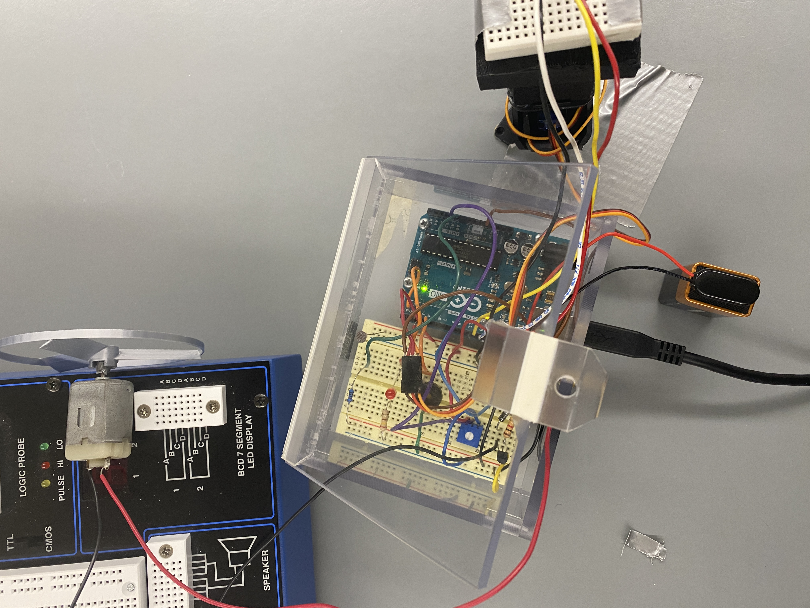
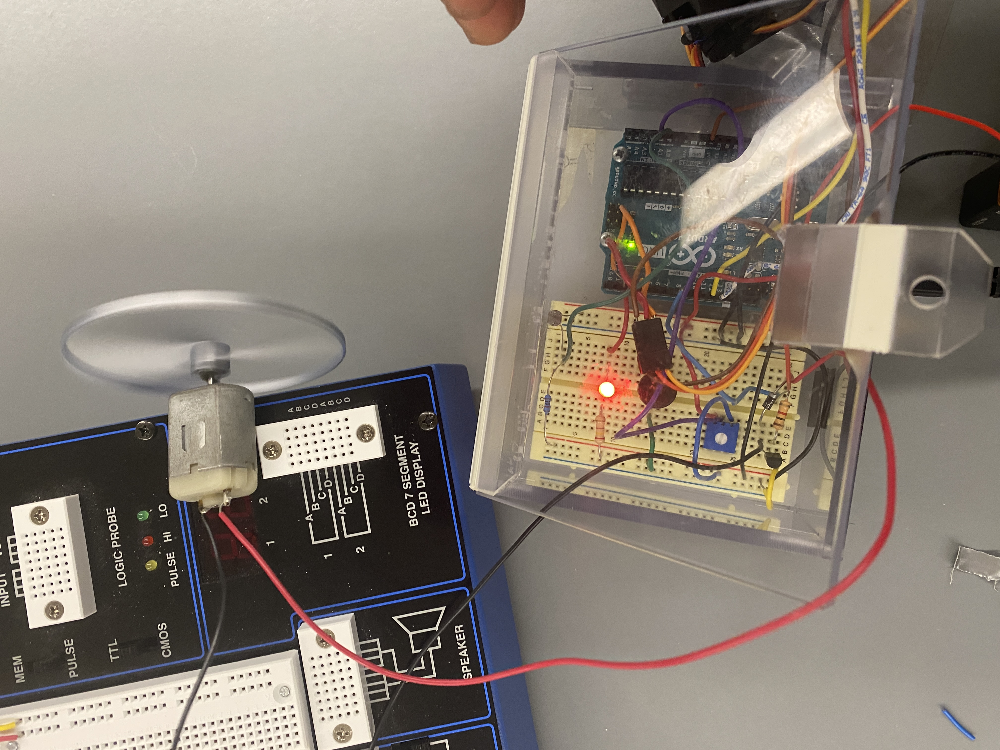
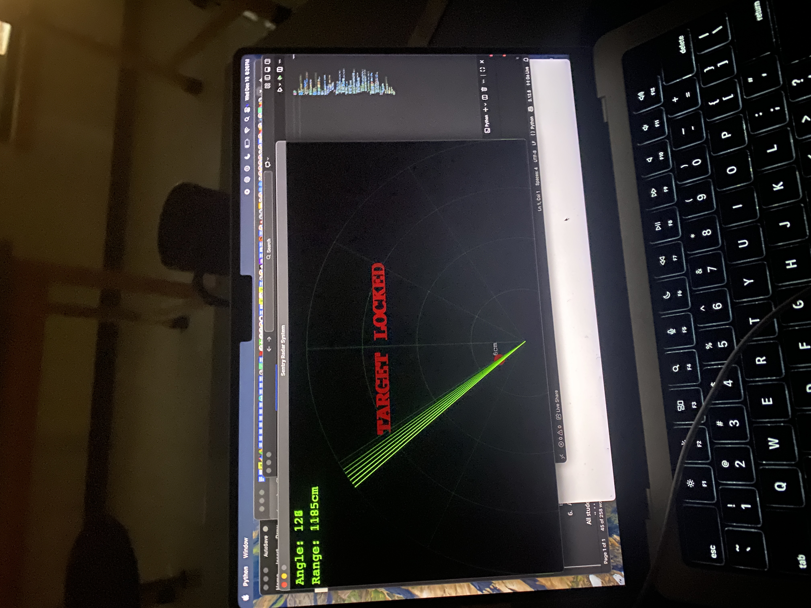

# 🎯 Autonomous Lidar Control System

<div align="center">


**A real-time embedded control system for automated radar scanning with centimeter-level precision obstacle detection**

</div>

---

## 📸 Demo

<div align="center">


_Hardware setup: Servo-mounted ultrasonic sensor with Arduino controller_


_System assembly with sensor array and actuators_


_Real-time radar visualization showing detected objects_

</div>

### 🎥 Video Demo

<!-- Option 1: Link to YouTube/external video -->

[](https://youtube.com/your-video-link)

<!-- Option 2: GIF (recommended for GitHub) -->
<!--  -->

---

## 📋 Overview

This project implements a **real-time control system** for automated actuation, integrating ultrasonic Lidar sensor data via **UART protocols** to map obstruction zones with centimeter-level precision. The system features a sweeping radar display with visual feedback and smart alarm capabilities.

### Key Features

- 🔄 **180° Automated Sweep** - Servo-controlled scanning from 15° to 165°
- 📏 **Centimeter-Level Precision** - HC-SR04 ultrasonic sensor with accurate distance measurement
- ⚡ **<50ms Response Time** - Optimized state-machine transitions for real-time processing
- 🚨 **Smart Alarm System** - Ambient light-aware alarm with LED, buzzer, and motor actuation
- 📊 **Real-Time Visualization** - Multiple visualization options (Python/Pygame & Processing)
- 🎚️ **Adjustable Sensitivity** - Potentiometer-controlled detection threshold (5-50cm)

---

## 🏗️ System Architecture

```
┌─────────────────────────────────────────────────────────────────┐
│                    AUTONOMOUS LIDAR SYSTEM                      │
├─────────────────────────────────────────────────────────────────┤
│                                                                 │
│  ┌──────────────┐    UART     ┌──────────────────────────────┐  │
│  │   Arduino    │────────────▶│   Visualization (Python/     │  │
│  │   Uno/Nano   │  9600 baud  │   Processing)                │  │
│  └──────────────┘             └──────────────────────────────┘  │
│         │                                                       │
│         ▼                                                       │
│  ┌──────────────────────────────────────────────────────────┐   │
│  │                    SENSOR ARRAY                          │   │
│  │  • HC-SR04 Ultrasonic (Trig: Pin 12, Echo: Pin 13)      │   │
│  │  • SG90 Servo Motor (PWM: Pin 2)                        │   │
│  │  • LDR Light Sensor (Analog: A0)                        │   │
│  │  • Potentiometer (Analog: A1)                           │   │
│  └──────────────────────────────────────────────────────────┘   │
│         │                                                       │
│         ▼                                                       │
│  ┌──────────────────────────────────────────────────────────┐   │
│  │                   OUTPUT ACTUATORS                       │   │
│  │  • LED Indicator (Pin 3)                                │   │
│  │  • Passive Buzzer (Pin 4)                               │   │
│  │  • High-Power Motor via Transistor (Pin 8)              │   │
│  └──────────────────────────────────────────────────────────┘   │
│                                                                 │
└─────────────────────────────────────────────────────────────────┘
```

---

## 🔧 Hardware Requirements

| Component          | Quantity | Description                           |
| ------------------ | -------- | ------------------------------------- |
| Arduino Uno/Nano   | 1        | Main microcontroller                  |
| HC-SR04            | 1        | Ultrasonic distance sensor            |
| SG90 Servo         | 1        | 180° rotation servo motor             |
| LDR                | 1        | Light-dependent resistor              |
| Potentiometer      | 1        | 10kΩ for sensitivity control          |
| LED                | 1        | 5mm indicator LED                     |
| Passive Buzzer     | 1        | Alarm output                          |
| Motor + Transistor | 1        | High-power actuation (NPN transistor) |
| Resistors          | Various  | 220Ω for LED, 10kΩ for LDR            |

### Pin Configuration

```c
// Ultrasonic Sensor
const int trigPin = 12;
const int echoPin = 13;

// Output Actuators
const int ledPin = 3;
const int buzzerPin = 4;
const int motorPin = 8;

// Analog Inputs
const int ldrPin = A0;
const int potPin = A1;

// Servo Motor
Servo myServo;  // Attached to Pin 2
```

---

## 🚀 Quick Start

**See the complete setup guide: [SETUP_GUIDE.md](SETUP_GUIDE.md)**

---

## 💻 Software Setup

### Arduino Firmware

1. Open `Radar_Code/Radar_Code.ino` in Arduino IDE
2. Select your board (Arduino Uno/Nano)
3. Select the correct COM port
4. Upload the sketch

### Python Visualization

```bash
# Install dependencies
pip install pygame pyserial

# Update serial port in radar.py
# macOS: "/dev/cu.usbmodem2101"
# Windows: "COM3", "COM4", etc.
# Linux: "/dev/ttyUSB0", "/dev/ttyACM0"

# Run visualization
python radar.py
```

### Processing Visualization (Alternative)

1. Open `Radar_Visualization.pde` in Processing IDE
2. Update `COM5` to your serial port
3. Run the sketch

---

## 📡 Communication Protocol

Data is transmitted via UART at **9600 baud** in the following format:

```
<angle>,<distance>.
```

| Field    | Type | Range  | Description                       |
| -------- | ---- | ------ | --------------------------------- |
| angle    | int  | 15-165 | Current servo position in degrees |
| distance | int  | 0-400  | Measured distance in centimeters  |

**Example:** `90,25.` → Angle: 90°, Distance: 25cm

---

## 🎮 Operation Modes

### Normal Scanning

- Continuous 180° sweep pattern
- Green radar line on visualization
- Distance displayed in real-time

### Target Lock (Object Detected)

- **LED**: Solid ON
- **Motor**: Activated (fan/cooling)
- **Buzzer**: Active only in low-light conditions
- **Display**: Red "TARGET LOCKED" warning

### Smart Features

- **Light-Aware Alarm**: Buzzer only activates when `lightLevel < 900` (nighttime)
- **Adjustable Threshold**: Potentiometer controls detection range (5-50cm)

---

## 📊 Performance Specifications

| Metric             | Value                   |
| ------------------ | ----------------------- |
| Sweep Range        | 150° (15° - 165°)       |
| Angular Resolution | 1° per step             |
| Response Time      | <50ms                   |
| Detection Range    | 2cm - 400cm             |
| Detection Accuracy | ±3mm                    |
| Sweep Period       | ~9 seconds (full cycle) |
| Baud Rate          | 9600 bps                |

---

## 🚀 Future Improvements

- [ ] Multiple ultrasonic sensors for wider coverage
- [ ] Data logging to SD card
- [ ] WiFi connectivity for remote monitoring
- [ ] Machine learning for object classification
- [ ] 3D-printed enclosure design

---

## 📁 Project Structure

```
Arduino/
├── README.md                    # This file
├── SETUP_GUIDE.md               # Step-by-step setup instructions
├── images/                      # Project photos and demos
│   ├── hardware.jpeg            # Hardware setup photo
│   ├── hardware1.jpeg           # System assembly photo
│   └── display.jpeg             # Radar visualization screenshot
├── Radar_Code/
│   └── Radar_Code.ino           # Arduino firmware
├── Lidar_Control_System_C/      # Comprehensive C implementation
│   ├── src/                     # Source files
│   │   ├── main.c               # Main application
│   │   ├── hal.c                # Hardware abstraction layer
│   │   └── state_machine.c      # State machine logic
│   ├── drivers/                 # Hardware drivers
│   │   ├── uart.c/h             # UART communication
│   │   ├── pwm.c/h              # Motor control
│   │   └── sensor.c/h           # Sensor interface
│   ├── include/                 # Header files
│   │   ├── config.h             # System configuration
│   │   └── hal.h                # HAL interface
│   └── Makefile                 # Build system
├── radar.py                     # Python/Pygame visualization
└── Radar_Visualization.pde      # Processing visualization
```

---

## 📜 License

This project is open source and available under the [MIT License](LICENSE).

---

## 👨‍💻 Author

**Paul Adutwum**

_Embedded Systems Developer_

---

<div align="center">

**Built with ❤️ and Arduino**

</div>
